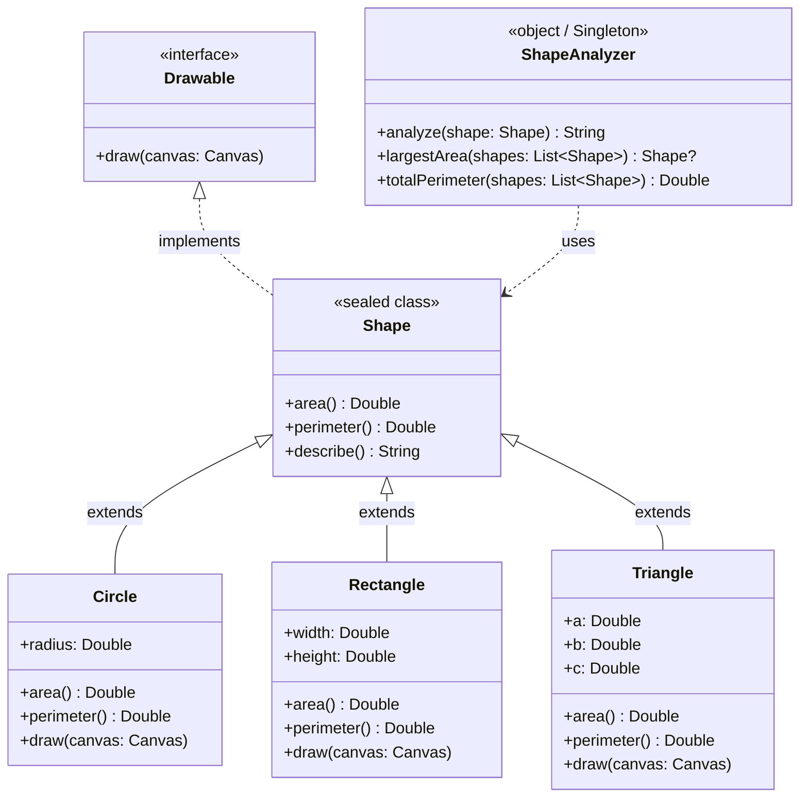
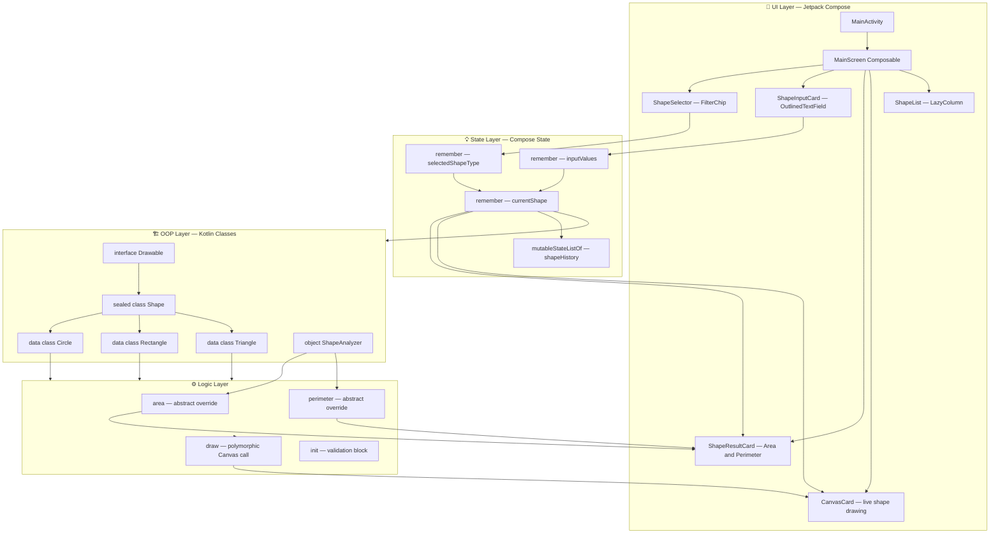
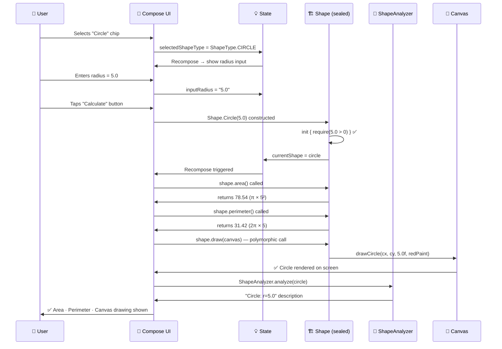
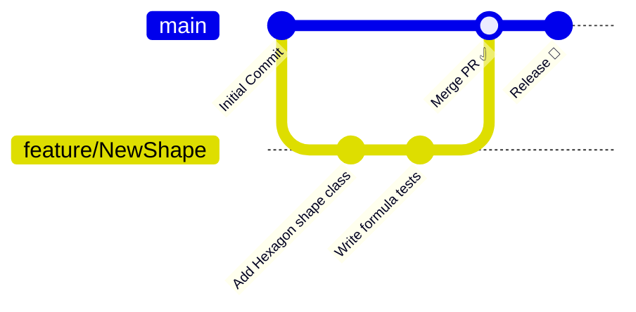

<div align="center">


<br/>

[](https://git.io/typing-svg)

<br/>

[](https://android.com)
[](https://kotlinlang.org)
[](https://developer.android.com/jetpack/compose)
[](https://m3.material.io)
[](#-key-concepts-learned)
[](LICENSE)

<br/>

> 📐 **Shape Calculator** is a clean, modern Android app that calculates area & perimeter
> of Circle, Rectangle and Triangle — draws them live on Canvas via **Polymorphism**,
> built with **Jetpack Compose**, **Material 3**, and showcases core **Kotlin OOP concepts**:
> `sealed class`, `interface`, `abstract`, `object`, `override`, and more.

<br/>

[📥 Download App](#-download) • [🚀 Getting Started](#-getting-started) • [✨ Features](#-features) • [📚 Key Concepts](#-key-concepts-learned) • [🏗️ Architecture](#-architecture) • [🤝 Contributing](#-contributing)

</div>

---

## 📖 Table of Contents

- [🌟 About](#-about)
- [📥 Download](#-download)
- [📸 Screenshots](#-screenshots)
- [✨ Features](#-features)
- [📚 Key Concepts Learned](#-key-concepts-learned)
- [🛠️ Tech Stack](#-tech-stack)
- [🏗️ Architecture](#-architecture)
- [🚀 Getting Started](#-getting-started)
- [🧪 Running Tests](#-running-tests)
- [📁 Project Structure](#-project-structure)
- [🗺️ Roadmap](#-roadmap)
- [🤝 Contributing](#-contributing)
- [📄 License](#-license)
- [📬 Contact](#-contact)

---

## 🌟 About

**Shape Calculator** is a minimal yet architecturally rich Android app that lets you:
- Select any shape — **Circle**, **Rectangle**, or **Triangle**
- Enter dimensions and **instantly calculate Area & Perimeter**
- Watch shapes **drawn live on Canvas** via polymorphic `draw()` calls
- Explore results through a **color-coded card UI** 🔴🔵🟢

It is built as a **hands-on Kotlin OOP learning project** demonstrating:

- 🏗️ **Sealed Classes** — restricted, type-safe shape hierarchy
- 🔌 **Interfaces** — `Drawable` contract enforced across all shapes
- 🔄 **Polymorphism** — `draw()` behaves differently per shape type
- 🏢 **Singleton Pattern** — `ShapeAnalyzer` object for centralized logic
- 🧩 **Jetpack Compose** — declarative Canvas drawing, no XML layouts
- 🎨 **Material 3** — modern theming with `OutlinedTextField`, `Card`, `Button`

### 🎯 Who Is This For?

| Audience | Benefit |
|---|---|
| 👶 Android Beginners | Clean reference for OOP patterns in real Kotlin code |
| 🏗️ OOP Learners | See `sealed class`, `interface`, `abstract`, `override` in action |
| 🎨 Compose Explorers | Canvas drawing with `drawCircle()`, `drawRect()`, `drawPath()` |
| 🔬 Architecture Students | Understand Singleton, Factory, and Strategy patterns |
| 🧪 Testers | Simple, well-structured base for unit and UI tests |

---

## 📥 Download

<div align="center">

[](https://drive.google.com/file/d/16EKaYhaHPze59YVo1SvMGjABeUkv3dSr/view?usp=sharing)
[](#)

</div>

---

## 📸 Screenshots

> 💡 A clean, color-coded UI built entirely with Jetpack Compose and Material 3.

<div align="center">

<table>
  <tr>
    <td align="center"><b>🔴 Circle Calculator</b></td>
    <td align="center"><b>🔵 Rectangle Calculator</b></td>
    <td align="center"><b>🟢 Triangle Calculator</b></td>
  </tr>
  <tr>
    <td>
      
    </td>
    <td>
      
    </td>
    <td>
      
    </td>
  </tr>
</table>

> 📸 Replace placeholder images above with your actual screenshots

</div>

---

## ✨ Features

<table>
  <tr>
    <td>📐 <b>Three Shape Types</b></td>
    <td>Calculate for <b>Circle</b>, <b>Rectangle</b>, and <b>Triangle</b> — each with its own color identity 🔴🔵🟢</td>
  </tr>
  <tr>
    <td>📊 <b>Instant Calculations</b></td>
    <td>Real-time <b>Area</b> and <b>Perimeter</b> computed via <code>abstract fun area()</code> and <code>perimeter()</code></td>
  </tr>
  <tr>
    <td>🎨 <b>Canvas Drawing</b></td>
    <td>Each shape is drawn live on <b>Compose Canvas</b> via polymorphic <code>draw()</code> calls</td>
  </tr>
  <tr>
    <td>🏗️ <b>Sealed Class Hierarchy</b></td>
    <td><code>sealed class Shape</code> ensures a <b>restricted, compile-time-safe</b> shape hierarchy</td>
  </tr>
  <tr>
    <td>🔌 <b>Interface Contract</b></td>
    <td><code>interface Drawable</code> enforces <code>draw()</code> on every shape — true <b>OOP design</b></td>
  </tr>
  <tr>
    <td>🏢 <b>Singleton Analyzer</b></td>
    <td><code>object ShapeAnalyzer</code> provides centralized <code>analyze()</code> logic — one instance, always</td>
  </tr>
  <tr>
    <td>🔄 <b>Polymorphism in Action</b></td>
    <td>One <code>draw(canvas)</code> call dispatches to the correct shape renderer automatically</td>
  </tr>
  <tr>
    <td>🧠 <b>Smart Casts</b></td>
    <td><code>is</code> checks and <code>as</code> casts used for <b>type-safe shape branching</b></td>
  </tr>
  <tr>
    <td>✅ <b>Input Validation</b></td>
    <td><code>init {}</code> block validates dimensions on construction — no negative or zero values</td>
  </tr>
  <tr>
    <td>🎯 <b>Color-Coded Cards</b></td>
    <td>Circle = Red · Rectangle = Blue · Triangle = Green — <b>instant visual recognition</b></td>
  </tr>
  <tr>
    <td>🧩 <b>Modern Compose UI</b></td>
    <td>Built entirely with <b>Jetpack Compose</b> and <b>Material 3</b> — zero XML layouts</td>
  </tr>
  <tr>
    <td>📦 <b>Lightweight & Fast</b></td>
    <td>Zero heavy external dependencies — pure Kotlin OOP + Compose + Material 3</td>
  </tr>
</table>

---

## 📚 Key Concepts Learned

> 💡 This project was built as a **hands-on Kotlin OOP learning showcase**.
> Every class and function in the code teaches a specific OOP concept.

---

### 🏗️ 1. Sealed Class — Restricted Shape Hierarchy

```kotlin
sealed class Shape : Drawable {
    abstract fun area(): Double
    abstract fun perimeter(): Double

    data class Circle(val radius: Double) : Shape()
    data class Rectangle(val width: Double, val height: Double) : Shape()
    data class Triangle(val a: Double, val b: Double, val c: Double) : Shape()
}
```

| Property | What It Means |
|---|---|
| `sealed` | Only subclasses defined **in this file** are allowed — compile-time safety |
| `abstract fun area()` | Every subclass **must** provide its own area calculation |
| `abstract fun perimeter()` | Every subclass **must** provide its own perimeter calculation |
| `data class` subclasses | Auto-generate `equals()`, `hashCode()`, `copy()`, `toString()` |

> ✅ Sealed classes are the Kotlin-idiomatic way to represent restricted hierarchies.
> The compiler knows **every possible subtype** — enabling exhaustive `when` expressions.

---

### 🔌 2. Interface — The Drawable Contract

```kotlin
interface Drawable {
    fun draw(canvas: Canvas)  // every shape MUST implement this
}
```

**Each shape fulfills the contract differently:**

```kotlin
data class Circle(val radius: Double) : Shape() {
    override fun draw(canvas: Canvas) {
        canvas.drawCircle(centerX, centerY, radius.toFloat(), paint)
    }
}

data class Rectangle(val width: Double, val height: Double) : Shape() {
    override fun draw(canvas: Canvas) {
        canvas.drawRect(left, top, right, bottom, paint)
    }
}

data class Triangle(val a: Double, val b: Double, val c: Double) : Shape() {
    override fun draw(canvas: Canvas) {
        val path = Path().apply { /* triangle path */ }
        canvas.drawPath(path, paint)
    }
}
```

> ✅ Interfaces define **what** a class must do — not **how** it does it.
> This is the foundation of **programming to an abstraction**.

---

### 🔄 3. Polymorphism — One Call, Many Behaviors

```kotlin
fun renderShape(shape: Shape) {
    shape.draw(canvas)      // 🎨 draws differently per type
    val a = shape.area()    // 📐 calculates differently per type
    val p = shape.perimeter() // 📏 calculates differently per type
}
```

**The power of polymorphism — same call site, different behavior:**

```kotlin
val shapes: List<Shape> = listOf(
    Shape.Circle(5.0),
    Shape.Rectangle(10.0, 6.0),
    Shape.Triangle(3.0, 4.0, 5.0)
)

shapes.forEach { shape ->
    shape.draw(canvas)         // ← compiler dispatches to correct draw()
    println(shape.area())      // ← 78.54 · 60.0 · 6.0 (respectively)
}
```

| Call | Circle | Rectangle | Triangle |
|---|---|---|---|
| `shape.draw()` | `drawCircle()` | `drawRect()` | `drawPath()` |
| `shape.area()` | `π·r²` | `w × h` | `Heron's formula` |
| `shape.perimeter()` | `2·π·r` | `2(w+h)` | `a + b + c` |

> ✅ This is **runtime polymorphism** — the JVM decides which implementation to call
> based on the actual type at runtime.

---

### 🏢 4. Singleton — ShapeAnalyzer Object

```kotlin
object ShapeAnalyzer {

    fun analyze(shape: Shape): String {
        return when (shape) {
            is Shape.Circle    -> "Circle: r=${shape.radius}"
            is Shape.Rectangle -> "Rect: ${shape.width}×${shape.height}"
            is Shape.Triangle  -> "Triangle: ${shape.a},${shape.b},${shape.c}"
        }
    }

    fun largestArea(shapes: List<Shape>): Shape? =
        shapes.maxByOrNull { it.area() }

    fun totalPerimeter(shapes: List<Shape>): Double =
        shapes.sumOf { it.perimeter() }
}
```

**Usage:**
```kotlin
ShapeAnalyzer.analyze(Shape.Circle(5.0))
// → "Circle: r=5.0"

ShapeAnalyzer.largestArea(listOf(circle, rect, triangle))
// → returns the Shape with highest area (null-safe)
```

| Property | What It Means |
|---|---|
| `object` keyword | Creates a **Singleton** — only one instance ever exists |
| No constructor | Instantiated lazily by the JVM the first time it's accessed |
| Thread-safe | Kotlin `object` initialization is inherently thread-safe |
| `when (shape)` | Exhaustive `when` — compiler enforces all sealed subclasses are handled |

> ✅ `object` is Kotlin's native Singleton — no `getInstance()`, no boilerplate.

---

### 🧩 5. Abstract Class vs Interface — When to Use Which

```kotlin
// Abstract class — shared STATE + behavior
sealed class Shape : Drawable {
    abstract fun area(): Double       // subclasses MUST implement
    abstract fun perimeter(): Double  // subclasses MUST implement

    fun describe(): String =          // shared implementation (concrete)
        "Area: ${"%.2f".format(area())} | Perimeter: ${"%.2f".format(perimeter())}"
}

// Interface — pure CONTRACT (no state)
interface Drawable {
    fun draw(canvas: Canvas)  // contract only — no implementation
}
```

| | `sealed class Shape` | `interface Drawable` |
|---|---|---|
| **Can have state** | ✅ Yes | ❌ No |
| **Can have concrete methods** | ✅ Yes (`describe()`) | ⚠️ Default only |
| **Multiple inheritance** | ❌ No | ✅ Yes |
| **Purpose** | Shared base + hierarchy | Capability contract |

---

### 🎭 6. when Expression — Exhaustive Shape Matching

```kotlin
fun getShapeColor(shape: Shape): Color = when (shape) {
    is Shape.Circle    -> Color(0xFFFF1744)  // 🔴 Red
    is Shape.Rectangle -> Color(0xFF2962FF)  // 🔵 Blue
    is Shape.Triangle  -> Color(0xFF00C853)  // 🟢 Green
}
// ✅ No else needed — compiler knows all sealed subclasses!
```

```kotlin
fun describeArea(shape: Shape): String = when (shape) {
    is Shape.Circle    -> "π × ${shape.radius}² = ${"%.2f".format(shape.area())}"
    is Shape.Rectangle -> "${shape.width} × ${shape.height} = ${"%.2f".format(shape.area())}"
    is Shape.Triangle  -> "Heron's Formula = ${"%.2f".format(shape.area())}"
}
```

> ✅ With sealed classes, `when` is **exhaustive by default** — the compiler
> will error if you forget to handle any subtype. No silent bugs.

---

### 🔁 7. override — Each Shape Owns Its Formula

```kotlin
// Circle
data class Circle(val radius: Double) : Shape() {
    override fun area(): Double = Math.PI * radius * radius
    override fun perimeter(): Double = 2 * Math.PI * radius
    override fun draw(canvas: Canvas) { canvas.drawCircle(...) }
}

// Rectangle
data class Rectangle(val width: Double, val height: Double) : Shape() {
    override fun area(): Double = width * height
    override fun perimeter(): Double = 2 * (width + height)
    override fun draw(canvas: Canvas) { canvas.drawRect(...) }
}

// Triangle (Heron's Formula)
data class Triangle(val a: Double, val b: Double, val c: Double) : Shape() {
    override fun area(): Double {
        val s = (a + b + c) / 2  // semi-perimeter
        return Math.sqrt(s * (s-a) * (s-b) * (s-c))
    }
    override fun perimeter(): Double = a + b + c
    override fun draw(canvas: Canvas) { canvas.drawPath(...) }
}
```

| Formula | Shape | Implementation |
|---|---|---|
| `π × r²` | Circle | `Math.PI * radius * radius` |
| `2π × r` | Circle | `2 * Math.PI * radius` |
| `w × h` | Rectangle | `width * height` |
| `2(w + h)` | Rectangle | `2 * (width + height)` |
| Heron's | Triangle | `sqrt(s(s-a)(s-b)(s-c))` |
| `a + b + c` | Triangle | direct sum |

---

### 🛡️ 8. init Block — Constructor Validation

```kotlin
data class Circle(val radius: Double) : Shape() {
    init {
        require(radius > 0) { "Radius must be positive, got: $radius" }
    }
}

data class Rectangle(val width: Double, val height: Double) : Shape() {
    init {
        require(width > 0 && height > 0) {
            "Dimensions must be positive: width=$width, height=$height"
        }
    }
}
```

> ✅ `init {}` blocks run immediately after the constructor.
> `require()` throws `IllegalArgumentException` with your message if the condition fails.
> This ensures **no invalid shapes can ever be constructed**.

---

### 🔄 9. Compose State — Reactive Shape UI

```kotlin
var selectedShape  by remember { mutableStateOf<Shape?>(null) }
var inputRadius    by remember { mutableStateOf("") }
var inputWidth     by remember { mutableStateOf("") }
var inputHeight    by remember { mutableStateOf("") }
var shapeList      by remember { mutableStateListOf<Shape>() }
```

**Reactive shape creation flow:**
```kotlin
Button(onClick = {
    val radius = inputRadius.toDoubleOrNull() ?: return@Button
    val circle = Shape.Circle(radius)   // sealed class instantiation
    shapeList.add(circle)               // mutableStateListOf triggers recompose
    selectedShape = circle              // state update → UI rerenders
}) {
    Text("Add Circle")
}
```

```
User enters radius
    → toDoubleOrNull() safely parses input
        → Shape.Circle(radius) constructed (init validates)
            → shapeList.add() updates mutableStateListOf
                → Compose detects state change
                    → LazyColumn recomposes
                        → New shape card appears ✅
```

---

### 📊 10. Summary — All OOP Concepts at a Glance

| # | Concept | Where Used in Code |
|---|---|---|
| 1 | `sealed class` | `sealed class Shape : Drawable` — restricted hierarchy |
| 2 | `interface` | `interface Drawable` — `draw()` contract |
| 3 | `abstract fun` | `area()` and `perimeter()` — must be overridden |
| 4 | `override` | Each shape provides its own formula implementations |
| 5 | `object` | `ShapeAnalyzer` Singleton — one instance, global access |
| 6 | `data class` | `Circle`, `Rectangle`, `Triangle` — with auto-utilities |
| 7 | Polymorphism | `shape.draw()` dispatches to correct renderer at runtime |
| 8 | `when` expression | Exhaustive shape type matching — compiler-enforced |
| 9 | `init {}` | Dimension validation on construction — fail fast |
| 10 | `is` / `as` | Smart casts for type-safe shape branching |
| 11 | `companion object` | Shape factory & mathematical constants |
| 12 | Extension functions | `.describe()` on any `Shape` instance |
| 13 | `mutableStateListOf` | Reactive shape list — Compose auto-rerenders |
| 14 | `toDoubleOrNull()` | Safe input parsing — no `NumberFormatException` |
| 15 | Canvas API | `drawCircle()` · `drawRect()` · `drawPath()` |

---

## 🛠️ Tech Stack

<div align="center">

[](https://skillicons.dev)

</div>

<br/>

| Category | Technology | Purpose |
|---|---|---|
| 🔤 **Language** | Kotlin 1.9+ | Primary language — OOP & functional features |
| 🧩 **UI Framework** | Jetpack Compose | Declarative modern UI + Canvas drawing |
| 🎨 **Design System** | Material 3 | Components, theming & color system |
| 🏗️ **OOP Patterns** | Sealed · Interface · Singleton | Core architectural decisions |
| 🔄 **State Management** | `remember` + `mutableStateListOf` | Reactive UI without ViewModel |
| 🎨 **Canvas API** | `drawCircle` · `drawRect` · `drawPath` | Shape rendering on screen |
| 🏗️ **Architecture** | Single Activity + Compose | Minimal, focused structure |
| 🔨 **Build System** | Gradle (Kotlin DSL) | Build and dependency management |
| 🧪 **Testing** | JUnit 4 + AndroidJUnit4 | Unit and instrumented tests |

---

## 🏗️ Architecture

Shape Calculator follows a **Compose-first single-activity architecture** layered
with clean OOP design — keeping the code readable, testable, and extensible.

### 🗂️ Class Hierarchy Diagram



### 🗂️ Full Architecture Diagram



### 🔄 State & OOP Flow



### 📋 Layer Responsibilities

| Layer | Component | Responsibility |
|---|---|---|
| **Entry** | `MainActivity.kt` | Single entry point — sets `MaterialTheme`, calls root composable |
| **UI** | `MainScreen` + sub-composables | Shape selector, input fields, result cards, Canvas card |
| **State** | `remember` + `mutableStateListOf` | Reactive state — shape type, inputs, current shape, history |
| **OOP** | `sealed class Shape` | Hierarchy — Circle, Rectangle, Triangle with their formulas |
| **Contract** | `interface Drawable` | Enforces `draw()` on every shape |
| **Singleton** | `object ShapeAnalyzer` | Centralized analysis — largest area, total perimeter |
| **Canvas** | `draw()` overrides | Polymorphic rendering — each shape draws itself |

---

## 🚀 Getting Started

### Prerequisites

- ✅ Android Studio **Giraffe** or newer
- ✅ JDK **17+**
- ✅ Android device or emulator running **API 24+** (Android 7.0)
- ✅ Kotlin **1.9.0+**

### Installation

**1. Clone the repository**
```bash
git clone https://github.com/atanucsejgec/Shape_Calculator.git
cd Shape_Calculator
```

**2. Open in Android Studio**
```
File → Open → Select the cloned Shape_Calculator folder
```

**3. Sync Gradle**
```bash
./gradlew build
```

**4. Run the App**
```bash
# Via terminal
./gradlew installDebug

# Or press Shift + F10 in Android Studio
```

> 💡 No API keys or external configurations needed — just clone and run!

---

## 🧪 Running Tests

```bash
# ✅ Run all Unit Tests (shape formula logic)
./gradlew test

# ✅ Run Instrumented UI Tests (requires connected device or emulator)
./gradlew connectedAndroidTest

# ✅ Run with verbose output for debugging
./gradlew test --info
```

**Example unit tests you should write:**

```kotlin
class ShapeTest {

    @Test
    fun `circle area is correct`() {
        val circle = Shape.Circle(5.0)
        assertEquals(78.54, circle.area(), 0.01)
    }

    @Test
    fun `rectangle perimeter is correct`() {
        val rect = Shape.Rectangle(10.0, 6.0)
        assertEquals(32.0, rect.perimeter(), 0.001)
    }

    @Test
    fun `triangle area by heron formula`() {
        val tri = Shape.Triangle(3.0, 4.0, 5.0)
        assertEquals(6.0, tri.area(), 0.001)
    }

    @Test(expected = IllegalArgumentException::class)
    fun `circle with negative radius throws`() {
        Shape.Circle(-1.0)  // init block should throw
    }

    @Test
    fun `ShapeAnalyzer finds largest area`() {
        val shapes = listOf(Shape.Circle(5.0), Shape.Rectangle(3.0, 4.0))
        val largest = ShapeAnalyzer.largestArea(shapes)
        assertTrue(largest is Shape.Circle)
    }
}
```

| Test Type | Command | Source Location |
|---|---|---|
| Unit Tests | `./gradlew test` | `src/test/java/` |
| Instrumented Tests | `./gradlew connectedAndroidTest` | `src/androidTest/java/` |

---

## 📁 Project Structure

```
📁 com.apk.shapecalculator
│
├── 📁 model/
│   ├── 🔌 Drawable.kt              # Interface — draw(canvas) contract
│   └── 📐 Shape.kt                 # sealed class Shape : Drawable
│                                   #    ├── data class Circle(radius)
│                                   #    ├── data class Rectangle(width, height)
│                                   #    └── data class Triangle(a, b, c)
│
├── 📁 analyzer/
│   └── 🏢 ShapeAnalyzer.kt         # object ShapeAnalyzer (Singleton)
│                                   #    ├── analyze(shape) — when expression
│                                   #    ├── largestArea(shapes) — maxByOrNull
│                                   #    └── totalPerimeter(shapes) — sumOf
│
├── 📁 ui/
│   ├── 📁 theme/
│   │   ├── 🎨 Color.kt             # Shape color palette (Red/Blue/Green)
│   │   ├── 📝 Typography.kt        # Font styles
│   │   └── 🎨 Theme.kt             # MaterialTheme setup
│   │
│   ├── 📁 components/
│   │   ├── 🔴 ShapeSelector.kt     # FilterChip — Circle/Rect/Triangle picker
│   │   ├── 📝 ShapeInputCard.kt    # OutlinedTextField inputs per shape
│   │   ├── 📊 ShapeResultCard.kt   # Area & Perimeter display card
│   │   └── 🎨 CanvasCard.kt        # Compose Canvas — polymorphic draw()
│   │
│   └── 🖥️ MainScreen.kt           # Root composable — wires all components
│
├── 📄 MainActivity.kt              # 🚀 App entry point
│
├── 📄 ExampleUnitTest.kt           # 🧪 Shape formula unit tests
└── 📄 ExampleInstrumentedTest.kt   # 🤖 Instrumented UI tests
```

---

## 🗺️ Roadmap

```mermaid
graph LR
    subgraph DONE["✅ Completed"]
        A[Sealed Class Hierarchy]
        B[Interface — Drawable]
        C[Polymorphic draw on Canvas]
        D[Singleton ShapeAnalyzer]
        E[Circle · Rectangle · Triangle]
        F[Area & Perimeter Formulas]
        G[Color-coded Result Cards]
        H[Material 3 Theming]
        I[Input Validation — init block]
    end

    subgraph WIP["🔄 In Progress"]
        J[Comprehensive Unit Tests]
        K[Accessibility — TalkBack]
    end

    subgraph PLAN["📋 Planned"]
        L[Shape History Log]
        M[Save & Share Results]
        N[3D Shape Support — Sphere · Cube]
        O[Custom Shape Color Picker]
        P[ViewModel + State Hoisting]
        Q[Play Store Release]
    end

    DONE --> WIP --> PLAN
```



| Status | Feature |
|---|---|
| ✅ Done | `sealed class Shape` hierarchy |
| ✅ Done | `interface Drawable` contract |
| ✅ Done | Polymorphic Canvas `draw()` |
| ✅ Done | `object ShapeAnalyzer` Singleton |
| ✅ Done | Circle, Rectangle, Triangle with formulas |
| ✅ Done | Area & Perimeter calculations |
| ✅ Done | Color-coded shape cards 🔴🔵🟢 |
| ✅ Done | Material 3 theming |
| ✅ Done | `init {}` input validation |
| 🔄 In Progress | Complete unit test coverage |
| 🔄 In Progress | TalkBack accessibility support |
| 📋 Planned | Shape history & comparison log |
| 📋 Planned | Save & share results as image |
| 📋 Planned | 3D shapes — Sphere, Cube, Cylinder |
| 📋 Planned | ViewModel + proper state hoisting |
| 💡 Idea | Custom shape color picker |
| 💡 Idea | Google Play Store release |

---

## 🤝 Contributing

Contributions are **always welcome**! 🌟



**Steps to Contribute:**

1. **Fork** the project
2. **Create** your feature branch
   ```bash
   git checkout -b feature/AmazingFeature
   ```
3. **Commit** your changes using Conventional Commits
   ```bash
   git commit -m "feat: add Hexagon shape with area formula"
   ```
4. **Push** to your branch
   ```bash
   git push origin feature/AmazingFeature
   ```
5. **Open** a Pull Request 🎉

### 📋 Commit Convention

| Prefix | Purpose | Example |
|---|---|---|
| `feat:` | New feature | `feat: add Ellipse shape class` |
| `fix:` | Bug fix | `fix: triangle area formula edge case` |
| `refactor:` | Code refactor | `refactor: move ShapeAnalyzer to separate module` |
| `test:` | Add/update tests | `test: add unit tests for Rectangle perimeter` |
| `docs:` | Documentation | `docs: update README OOP concepts section` |
| `chore:` | Config/build changes | `chore: update gradle version` |
| `style:` | UI tweaks | `style: update shape card corner radius` |

### 📋 Contribution Guidelines

- Follow **Kotlin OOP conventions** — new shapes must extend `sealed class Shape`
- Implement **all three**: `area()`, `perimeter()`, and `draw()` for any new shape
- Add `init {}` **validation** for all constructor parameters
- Write **unit tests** for every new shape formula
- Keep Composables **small, focused and reusable**
- Follow **Material 3** guidelines for any UI changes
- Update **README** for any new shapes or structural changes
- Use **conventional commits** for all commit messages

---

## 📄 License

Distributed under the **MIT License**. See [`LICENSE`](LICENSE) for full details.

```
MIT License

Copyright (c) 2026 Atanu Biswas

Permission is hereby granted, free of charge, to any person obtaining a copy
of this software and associated documentation files (the "Software"), to deal
in the Software without restriction, including without limitation the rights
to use, copy, modify, merge, publish, distribute, sublicense, and/or sell
copies of the Software, and to permit persons to whom the Software is
furnished to do so, subject to the following conditions:

The above copyright notice and this permission notice shall be included in
all copies or substantial portions of the Software.
```

---

## 📬 Contact

<div align="center">

**Atanu Biswas**

[](https://github.com/atanucsejgec)
[](https://github.com/atanucsejgec/Shape_Calculator)
[](https://drive.google.com/file/d/16EKaYhaHPze59YVo1SvMGjABeUkv3dSr/view?usp=sharing)

🌟 **Project Link:** [https://github.com/atanucsejgec/Shape_Calculator](https://github.com/atanucsejgec/Shape_Calculator)

</div>

---

<div align="center">

### ⭐ If Shape Calculator helped you understand Kotlin OOP, please drop a Star — it really means a lot! ⭐


</div>
